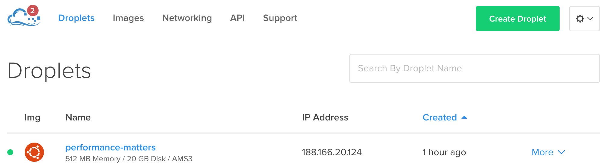
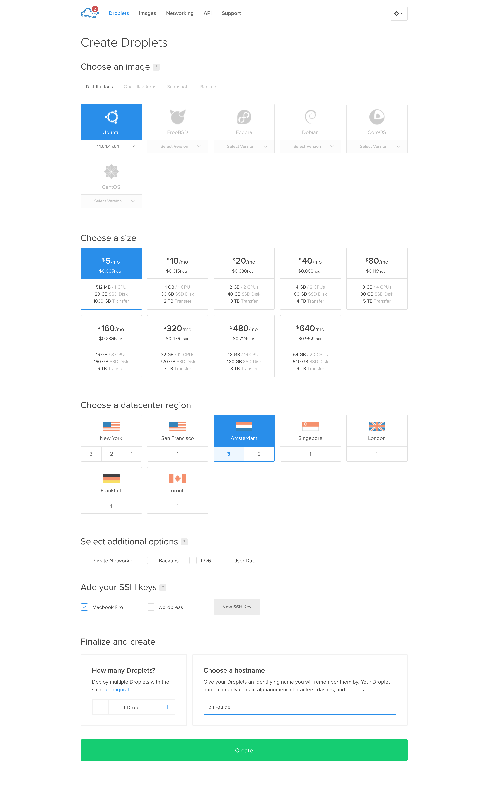

# Performance Matters Digital Ocean https guide.

## Nodig:
- Digital Ocean account.
- Domeinnaam

## Droplet setup

Maak een droplet aan door op de groene "Create Droplet" knop te klikken.



Aanbevolen instellingen:



Het beste is om een SSH key te gebruiken om te connecten naar je server, maar het kan ook zonder. Dan krijg je het root wachtwoord gemailed.

## Domein

Om je domein te linken aan je droplet moet je een A record toevoegen aan je domein DNS instellingen. Hoe dit moet kan je het best zelf even uitzoeken.

## Verbinden met de server

Alles wat je met de server wilt doen doe je via de command line.

*Vervang in de voorbeelden mijn IP met degene van je eigen Droplet*

Voer de volgende commands uit om te verbinden met je server:

```ssh root@128.199.52.241```

Als het goed is krijg je zoiets te zien:

```
Welcome to Ubuntu 14.04.4 LTS (GNU/Linux 3.13.0-79-generic x86_64)

 * Documentation:  https://help.ubuntu.com/

  System information as of Tue Mar 15 10:22:51 EDT 2016

  System load: 0.0               Memory usage: 9%   Processes:       52
  Usage of /:  7.4% of 19.56GB   Swap usage:   0%   Users logged in: 0

  Graph this data and manage this system at:
    https://landscape.canonical.com/

root@pm-guide:~# 
```

Nu maken we een nieuwe gebruiker aan zodat we niet altijd de root user gebruiken:

```adduser dennis```

```gpasswd -a dennis sudo```

Je kan nu op je nieuwe gebruiker inloggen door ```su - dennis``` te gebruiken.

## Node etc. installeren

```
curl -o- https://raw.githubusercontent.com/creationix/nvm/v0.31.0/install.sh | bash
source ~/.bashrc
nvm install 5.8
npm install -g pm2
```

## Eigen applicatie clonen met git

```
sudo apt-get install git
git clone https://github.com/dennis-van-bennekom/looklive-server.git ~/looklive-server
cd ~/looklive-server
npm install
```

Om te testen kunnen we de applicatie starten:
```node ./bin/www```

Als je nu in je browser naar **http://128.199.52.241:3000/** (eigen ip gebruiken!) gaat zie je je applicatie als het goed is.

PM2 zorgt ervoor dat je applicatie altijd aan staat wat er ook gebeurt. (restart etc.)

```
pm2 start ./bin/www
```

**Let's encrypt**

We gebruiken Let's encrypt voor de https.

```
sudo git clone https://github.com/letsencrypt/letsencrypt /opt/letsencrypt
cd /opt/letsencrypt
./letsencrypt-auto certonly --standalone
```

Vul je email in en dan je domeinnaam.

Nu zijn je SSL certificaten gemaakt.

## Webserver nginx installeren

`sudo nano /etc/apt/sources.list.d/nginx.list`

Zet in dit bestand:
```
deb http://nginx.org/packages/mainline/ubuntu/ trusty nginx
deb-src http://nginx.org/packages/mainline/ubuntu/ trusty nginx
```

Om nano af te sluiten doe de `ctrl+x` toetscombinatie en dan `y` om op te slaan.

```
wget -q -O- http://nginx.org/keys/nginx_signing.key | sudo apt-key add -
sudo apt-get update
sudo apt-get install nginx
```

**nginx configuratie:**

```sudo nano /etc/nginx/conf.d/default.conf```

Gebruik deze configuratie, maar verander mijn domein naam naar je eigen (ook bij ssl_certificate en ssl_certificate_key)

```
server {
    listen 80;
    server_name performance.dennisvanbennekom.com;

    return 301 https://$host$request_uri;
}

server {
    listen       443 ssl;
    server_name  performance.dennisvanbennekom.com;

    ssl_certificate /etc/letsencrypt/live/performance.dennisvanbennekom.com/fullchain.pem;
    ssl_certificate_key /etc/letsencrypt/live/performance.dennisvanbennekom.com/privkey.pem;

    ssl_protocols TLSv1 TLSv1.1 TLSv1.2;
    ssl_prefer_server_ciphers on;
    ssl_ciphers 'EECDH+AESGCM:EDH+AESGCM:AES256+EECDH:AES256+EDH';

    location / {
        proxy_pass http://localhost:3000;
        proxy_http_version 1.1;
        proxy_set_header Upgrade $http_upgrade;
        proxy_set_header Connection 'upgrade';
        proxy_set_header Host $host;
        proxy_cache_bypass $http_upgrade;
    }
}
```

Restart nginx:

```sudo service nginx restart```

**Klaar!**
